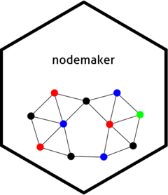

<!-- README.md is generated from README.Rmd. Please edit that file -->

```{r, include = FALSE}
knitr::opts_chunk$set(
  collapse = TRUE,
  comment = "#>",
  fig.path = "man/figures/README-",
  out.width = "100%"
)
```

# nodemaker

<!-- badges: start -->

<!-- badges: end -->

Producing network diagrams often involves working with data formatted in ways that aren't particularly useful for other purposes, hence one normally needs to spend time reformatting data to produce them. However, the format is pretty standard for all visualisations. Therefore this package should help reduce some of the most repetitive code in these processes to single-line functions.

## Installation
You can install the package using RStudio's tool, or via the following code, using the listed file location.
```{r, eval = F}
devtools::install_github("shanej90/nodemaker")
```

## Functionality
`nodemaker` can be used to prepare data for network diagram production. There are three main purposes:

* Prepare a list of nodes with any additional attributes desired, assuming the source data is held in a single dataframe. Use `make_nodes()`.
* Create a 'long' dataframe detailing nodes and their associated 'connecting objects' to other nodes. Use `make_connections()`.
* Create an edges dataframe, showing how nodes are connected, including relative weightings. Use `make_edges()`.
* Templates for plotting via the `tidygraph` package.
  
As an example, say you want to consider how people have collaborated on projects. In this case, the people (or rather their unique IDs) would be the nodes. The projects they have worked on would be the 'connecting objects'. The edges would show connections between people, based on how many projects they had collaborated on.

It is highly likely any raw source data you draw on will need some further processing before using `nodemaker` functions. For example, to filter to a relevant timeframe or status.
